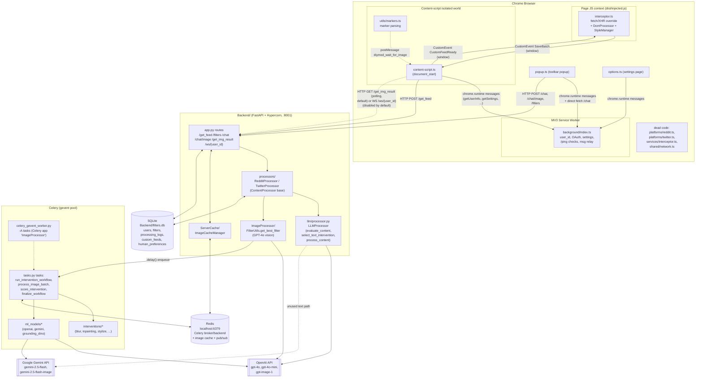

# SHIELD Architecture

## What it does

SHIELD (built on DIY-MOD) is a Chrome extension + backend service that personalizes social-media
moderation. Instead of only hiding content, it *transforms* it — blurring, overlaying a warning,
rewriting text, or AI-editing an image — based on each user's own natural-language filter rules
(e.g. "blur images of spiders", "rewrite anything about my ex"). The extension intercepts Reddit and
Twitter/X feed responses in the browser, sends the raw content to a Python backend, and the backend
uses LLMs/VLMs to decide what matches a user's filters and how to transform it before the content is
rendered.

## Component diagram

Boundaries below reflect what the code actually does, not an idealized design: the extension has
three separate JS execution contexts that only share data via `window` events/`postMessage` or
`chrome.runtime` messages (never direct function calls), and two legacy/dead code paths
(`platforms/reddit.ts`, `platforms/twitter.ts`, `services/interceptor.ts`, `shared/network.ts`) still
sit in the tree unused.



## Main content-processing sequence

Verified against current source (spot-checked, not re-derived from scratch — see
`docs/notes/main-flow.md` for the full hop-by-hop trace this is based on):

- Text processing **is** synchronous in the `/get_feed` request/response cycle, with up to **3**
  sequential OpenAI calls per matched post: `evaluate_content` (match check) →
  `select_text_intervention` (pick Modify-Segments/Add-Warning/Rewrite) →
  `_process_low/medium/high_intensity` (generate the marker-wrapped text). Confirmed in
  `Backend/llm/processor.py` and `Backend/processors/base_processor.py`.
- Image processing **does** go through Celery: `ImageProcessor.process_image()` makes one synchronous
  GPT-4o vision call (`FilterUtils.get_best_filter`) to pick a filter/interventions, then calls
  `run_intervention_workflow.delay(...)` and returns a `"status": "DEFERRED"` placeholder immediately —
  confirmed in `Backend/ImageProcessor/ImageProcessor.py` and `Backend/tasks.py`.
- `BrowserExtension/src/content/platforms/reddit.ts` / `twitter.ts` and
  `src/content/services/interceptor.ts` exist on disk but are **not** part of the live build — no Vite
  entry point or live import reaches them (confirmed via grep across `src/`). The live extension never
  parses Reddit/Twitter content client-side; it forwards the raw intercepted response text untouched to
  `/get_feed`, and all structural HTML/JSON parsing happens server-side in
  `processors/reddit_processor.py` / `processors/twitter_processor.py`.

```mermaid
sequenceDiagram
    participant Page as Page JS (injected.js)
    participant CS as content-script.ts (isolated world)
    participant API as Backend app.py (/get_feed)
    participant Proc as RedditProcessor/TwitterProcessor
    participant LLM as LLMProcessor (OpenAI)
    participant ImgSel as FilterUtils (GPT-4o vision)
    participant Celery as tasks.py (Celery/gevent)
    participant Redis as Redis cache
    participant DOM as DomProcessor + markers.ts

    Page->>Page: window.fetch/XHR override captures\nReddit/Twitter feed response
    Page->>CS: CustomEvent "SaveBatch" (raw response text)
    CS->>API: POST /get_feed\n{user_id, url, feed_info.response}
    API->>Proc: processor_class(user_id, feed_info, url).work_on_feed()
    Proc->>Proc: BeautifulSoup parse, find posts,\nasyncio.gather(process_post(*))
    loop per post
        Proc->>LLM: evaluate_content(text, filters) [LLM call 1]
        alt filters matched
            Proc->>LLM: select_text_intervention(...) [LLM call 2]
            Proc->>LLM: _process_*_intensity(...) [LLM call 3]
            LLM-->>Proc: marker-wrapped text (__BLUR_START__ etc.)
        end
        opt post has images
            Proc->>ImgSel: get_best_filter(image, filters) [sync GPT-4o call]
            ImgSel-->>Proc: chosen filter + candidate interventions
            Proc->>Celery: run_intervention_workflow.delay(payload)
            Proc->>Proc: mark image "status":"DEFERRED" placeholder
        end
    end
    Proc-->>API: modified HTML (markers + DEFERRED image placeholders)
    API-->>CS: 200 {feed:{response: modified_feed}}
    CS->>Page: CustomEvent "CustomFeedReady" (processed body)
    Page->>DOM: MutationObserver scans DOM for markers
    DOM->>DOM: processMarkedText() renders blur/overlay/rewrite spans

    par async image pipeline (Celery, after response already sent)
        Celery->>Celery: process_image_batch (generate N candidates, gevent pool)
        Celery->>Celery: score_intervention per candidate (VLM score)
        Celery->>Celery: finalize_workflow picks best, writes to Redis cache
        Celery->>Redis: set_processed_value_to_cache + publish "image_processing_complete"
    and extension polls for the image result
        DOM->>Page: img has diy-mod-image DEFERRED attr -> startImagePolling
        Page->>CS: postMessage diymod_wait_for_image
        CS->>API: GET /get_img_result?img_url=&filters= (poll, default path;\nWS /ws/{user_id} exists but useWebSockets=false by default)
        API->>Redis: get_processed_value_from_cache
        API-->>CS: {status: COMPLETED, processed_url/base64_url}
        CS->>Page: postMessage diymod_image_processed
        Page->>DOM: swap final image into 
    end
```

## Extension-to-backend API contract

Re-verified against current `Backend/app.py` route decorators and the extension's actual `fetch`/WS
call sites (base: `docs/notes/main-flow.md`'s endpoint cross-reference table).

| Method | Path | Payload (from extension) | Backend handler | Extension call site |
|---|---|---|---|---|
| POST | `/get_feed` | `{user_id, url, data:{feed_info:{response}}}` | `app.py:process_feed_route` | `shared/api/api-service.ts: processFeed()` |
| GET | `/filters?user_id=` | — | `app.py:get_filters_route` | `shared/api/api-service.ts: getUserFilters()`; also `popup.ts: checkExistingFilters()` (direct fetch) |
| POST | `/filters` | `{user_id, filter_text, content_type, intensity, duration}` | `app.py:create_filter_route` | `shared/api/api-service.ts: createFilter()` |
| PUT | `/filters/{filter_id}` | `{user_id, filter_text, content_type, intensity, duration}` | `app.py:update_filter_route` | `shared/api/api-service.ts: updateFilter()` |
| DELETE | `/filters/{filter_id}?user_id=` | — | `app.py:delete_filter_route` | `shared/api/api-service.ts: deleteFilter()` |
| POST | `/chat` | `{message, history, user_id}` | `app.py:chat` | `shared/api/api-service.ts: sendChatMessage()`; also `popup.ts: sendToLLM()` (direct fetch) |
| POST | `/chat/image` | multipart `FormData {image, message?, history?, user_id}` | `app.py:chat_with_image` | `shared/api/api-service.ts: processImage()`; also `popup.ts: sendImageToLLM()` (direct fetch) |
| GET | `/get_img_result?img_url=&filters=` | — | `app.py:get_img_result` | `shared/api/api-service.ts: pollForImageResult()`; `background/index.ts: pollForImageResult()` (legacy bridge) |
| GET | `/get_img_base64` | — | `app.py:get_img_base64` | **none found** — unused by the live extension |
| POST | `/user/update` | `{user_id, email}` | `app.py:update_user_info_endpoint` | `background/index.ts: updateUserInfoOnServer()` (only if `userStudy.active && collectEmail`) |
| GET | `/ping` | — | `app.py:ping` | `shared/api/api-service.ts: testConnection()`; `background/index.ts: checkServerConnection()`; `options.ts` |
| WS | `/ws/{user_id}` | `{type: 'ping'\|'pong'\|'wait_for_image', ...}` | `app.py:websocket_endpoint` | `shared/websocket/websocket-client.ts` — **disabled by default** (`useWebSockets: false`, and default `websocketUrl` port 8010 doesn't match the server's actual bind of 8001 anyway) |

`/custom-feed/*`, `/auth/*`, `/api/feeds/*`, `/upload-feed`, `/human-preferences/*` exist in `app.py`
but are consumed only by `reddit-clone/` (research tooling) or standalone scripts, never by the
browser extension — out of scope here, see `docs/backend.md`.

## Where to go next

- `docs/backend.md` — Backend folder guide, full route/task/model list, LLM usage, env vars.
- `docs/extension.md` — extension contexts, message catalogue, storage keys, build process.
- `docs/SETUP.md` — exact commands to run Redis, Celery, the API server, and build/load the extension.
